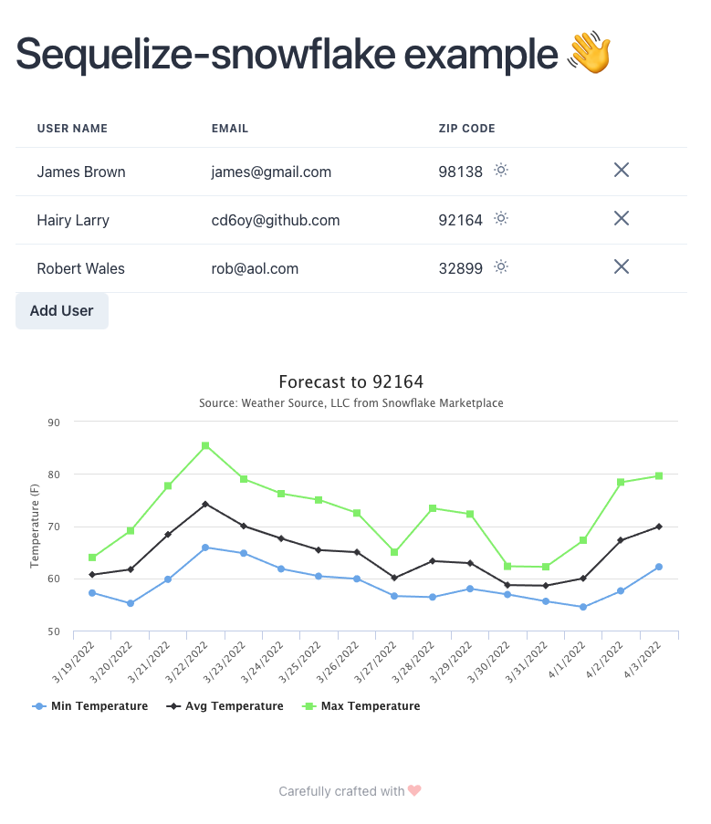

# NxSequelizeSnowflakeApp

Repo for Sequelize Snowflake Application

- Install dependency
```sh
# Some component is not compatible with react 17 at this moment
npm i --force 
```

- In your snowflake account, create a test db.

- Pull [Global Weather & Climate Data for BI](https://app.snowflake.com/marketplace/listing/GZSOZ1LLD8?search=weather&available=true) from snowflake marketplace to your account.

- Create `.local.env` by:
```sh
cp ./apps/nx-sequelize-snowflake-api/.env ./apps/nx-sequelize-snowflake-api/.local.env
```

- Update `.local.env` with all required snowflake config.

- Run command below to start the app:
```sh
npx nx serve nx-sequelize-snowflake-api
npx nx serve nx-sequelize-snowflake-app
```


